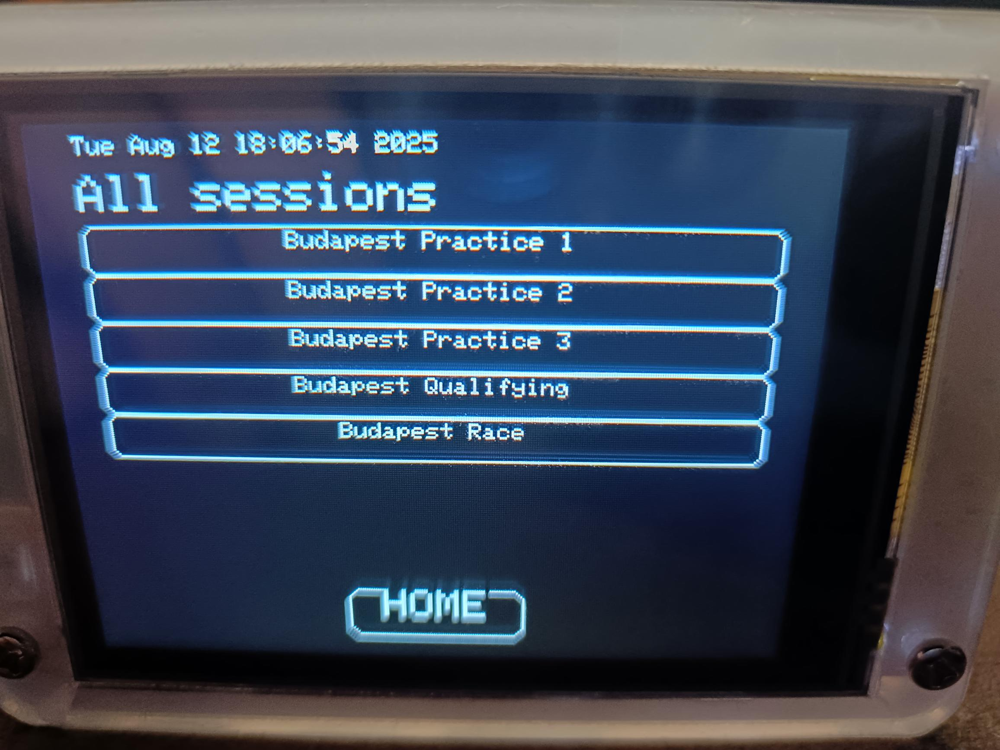
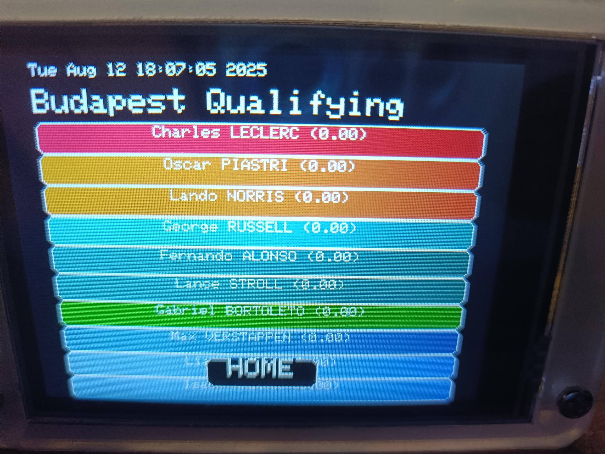
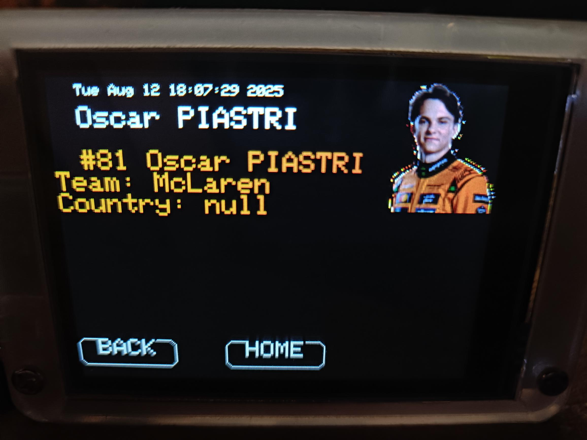

# F1-CYD
Display F1 (Formula 1) results and information on a CYD (Cheap Yellow Display) esp32. Information about the CYD can be found online, including https://randomnerdtutorials.com/cheap-yellow-display-esp32-2432s028r/

If you have got an esp32 based CYD and want to get a head start in some projects, this is aimed at integrating a number of the various features you might use such as touch display buttons, images, fetching from https websites, json and api integration.

This project makes use of:
* XPT2046 Touchscreen library - https://github.com/PaulStoffregen/XPT2046_Touchscreen
* TFT_eSPI library for the 320x240px screen - https://github.com/Bodmer/TFT_eSPI
* TFT_eSPI_Button buttons that seem to integrate nicely between the display and the touchscreen
* WiFiMulti and NetworkClientSecure libraries
* OpenF1 API data (by default it looks for sessions / results from the past week, so there may be none if it is in the off-season): https://www.openf1.org/
* png image loading using SPIFFS and fileFetcher and display using PNGdec library - https://github.com/bitbank2/PNGdec
* 24bit RGB to 16bit TFT colour conversion function

Load the .ino from the Arduino IDE, ensuring you have all relevant libraries installed. Edit the Wireless Access Point information, then upload it to your CYD.

The software will list the recent F1 sessions that have occured as a sequence of buttons. By selecting the session, it will display the results of the session as driver buttons, colour coded for their teams. Clicking on the driver will provide a screen with an image and other information about the driver.

Sometimes the API will refuse connections (probably when it has had a lot of connections in a short amount of time), so reloading later on should work.

Feel free to fix bugs for me / suggest revisions and if it is helpful for you, then feel free to buy me a coffee.

